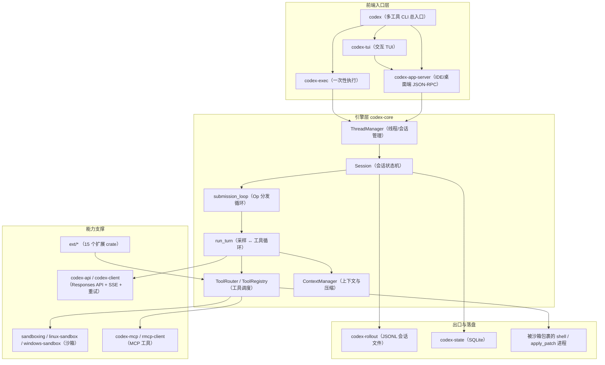

# Codex Code Graph — Agent 项目导航文档

> 本文档是整个仓库的「代码地图」。任何 Agent 在分析、修改、评审本项目之前，必须先读本文档建立全局认知，再按需深入具体模块。
> 最后更新：2026-09-15（基于 commit `508a006d7a` 的代码结构；`codex-rs` 版本号为占位符 `0.0.0`）

## ⚠️ Agent 强制工作流（必读）

1. **先读本文档定位模块，不要盲目全局搜索。** 本仓库有近 150 个 Rust crate，`rg` 全库搜索会淹掉你。
2. 用 code graph 方式沿调用链读「入口 → 中间层 → 落盘/出口」：符号引用追溯、值流追溯，或派探索子代理，再下结论。
3. **先判断任务归属哪条入口**：同一个能力往往有「谁在真正生效」的问题（见第 5 节，本仓库最容易改错的地方）。
4. 最小范围验证：Rust 侧用 `just test -p <crate>`，不要默认跑全量（见第 10 节）。

## 1. 项目一句话

**Codex CLI —— OpenAI 的本地编码 Agent。** 一个 Rust 写的 Agent 引擎（`codex-rs/`）驱动「模型采样 → 工具调用 → 沙箱执行 → 回填结果」的循环，外面套了三层壳：交互式 TUI、一次性 `codex exec`、以及给 IDE/桌面端用的 JSON-RPC app-server。

**必须记住的关键事实：**

- **引擎与前端已经解耦。** TUI 不再直接依赖 `codex-core`，而是进程内起一个 app-server 通过协议通信（第 6.1 节）。想改 TUI 行为，先想清楚改的是「壳」还是「引擎」。
- **`codex-rs/core`、`codex-rs/tui`、`codex-rs/app-server` 三个 crate 占了工作区约 70% 的代码量**，是绝对主战场；其余 140+ 个 crate 多是可替换的零件。
- **协议是稳定契约。** `Op` / `EventMsg` / app-server v1+v2 方法表一旦改动就是破坏性变更（破坏面清单见 `AGENTS.md` 的 Code Review Rules）。
- **`just` 的默认工作目录是 `codex-rs/`**，所有 recipe 都在那儿跑（第 11 节有坑）。

## 2. 技术栈速览

| 层 | 技术 | 事实来源 |
|---|---|---|
| 引擎语言 | Rust，edition 2024，工具链固定 `1.95.0` | `codex-rs/Cargo.toml` `[workspace.package]`、`codex-rs/rust-toolchain.toml` |
| 工作区规模 | 147 个显式 `members`，另有 5 个仅靠 path 依赖引入的隐式成员 | `codex-rs/Cargo.toml` |
| 异步/网络 | Tokio；`reqwest`（HTTP）、`tokio-tungstenite`（WebSocket）、`eventsource-stream`（SSE） | `codex-rs/core/Cargo.toml`、`codex-rs/codex-client` |
| 模型接口 | OpenAI Responses API（HTTP + WebSocket 双通道） | `codex-rs/codex-api`、`codex-rs/core/src/client.rs` |
| TUI | ratatui（`codex-tui` crate，自带 1000+ 个 insta 快照） | `codex-rs/tui/` |
| MCP | 官方 `rmcp`（钉死 `=3.2.0`） | `codex-rs/rmcp-client/Cargo.toml` |
| 持久化 | JSONL rollout 会话文件 + SQLite 状态库 + 线程存储抽象层 | `codex-rs/rollout/`、`codex-rs/state/`、`codex-rs/thread-store/` |
| V8 沙箱运行时 | `code-mode-runtime`（真实现）、`v8-poc`（占位符 crate） | `codex-rs/code-mode-runtime/`、`codex-rs/v8-poc/` |
| 构建 | Cargo（crate/feature 的唯一真源）+ Bazel（PR 验证与发布产物） | `codex-rs/docs/bazel.md` |
| 发布 | npm `@openai/codex` + GitHub Releases + 独立安装脚本 + PyPI | `.github/workflows/rust-release.yml` |
| Node 侧 | pnpm workspace：`codex-cli`（npm 包装器）、`sdk/typescript` | `pnpm-workspace.yaml`、`package.json` |
| Python 侧 | `sdk/python`（`openai-codex` SDK，类型由协议 schema 生成） | `sdk/python/pyproject.toml` |

## 3. 总体架构图



## 4. 目录地图（快速索引）

### 4.1 仓库顶层

| 目录/文件 | 语言 | 职责 | 何时来这里找 |
|---|---|---|---|
| `codex-rs/` | Rust | **全部引擎代码**，一个 147 成员的 Cargo 工作区 | 99% 的开发任务 |
| `codex-cli/` | JS | npm 包装器 `@openai/codex`（`bin/codex.js`），只负责选平台包并 spawn 原生二进制 | 安装/分发/包装器问题 |
| `sdk/typescript/` | TS | `@openai/codex-sdk`，spawn CLI 并交换 JSONL 事件 | TS SDK 用法与构建 |
| `sdk/python/`、`sdk/python-runtime/` | Python | `openai-codex` SDK 与 wheel 化的 CLI 运行时 | Python SDK、协议类型生成 |
| `docs/` | MD | **15 个文件、0 个子目录**，多为指向 developers.openai.com 的跳转占位页 | 只在确认需要时读；产品文档不写这里 |
| `scripts/` | Python/Shell | 构建与发布自动化（`codex_package/`、`stage_npm_packages.py`、`format.py`、`install/`） | 打包、格式化、CI 复现 |
| `tools/` | Rust/多语言 | 独立工具：`argument-comment-lint`（Dylint lint）、`buildifier` manifest | 参数注释 lint |
| `bazel/`、`third_party/`、`patches/` | Starlark | Bazel 规则、V8/voice/wine 三方构建、30 个上游 patch | Bazel 构建问题 |
| `.github/` | YAML/Python | CI 工作流、复合 action、发布脚本、Codex 自身的评审 prompt | CI/发布/自动化 |
| `.codex/` | MD/TOML | **仓库自带的 Codex skill 集**（`babysit-pr`、`code-review*`、`remote-tests`、`test-tui`、`update-v8-version` 等） | 想复用官方 agent 工作流时 |
| `justfile` | just | 全部开发命令入口（默认 cwd = `codex-rs/`） | 任何「怎么跑」的问题 |
| `flake.nix` | Nix | Rust 侧开发环境/打包 | 非必需 |

### 4.2 `codex-rs/` 核心二级目录

| 目录 | crate 名 | 职责 |
|---|---|---|
| `core/` | `codex-core` | **Agent 引擎本体**：Session/Turn 循环、工具路由、模型客户端、上下文与压缩、rollout、沙箱接管（约 39 万行，最大 crate） |
| `tui/` | `codex-tui` | ratatui 交互界面（约 35 万行，含 1000+ 快照）；**不直接依赖 `codex-core`** |
| `app-server/` | `codex-app-server` | JSON-RPC 服务端：传输层、`MessageProcessor`、`request_processors/`（约 18 万行） |
| `cli/` | `codex-cli` | `codex` 多工具二进制，含 `Subcommand` 分发（注意与顶层 `codex-cli/` npm 包同名不同物） |
| `exec/` | `codex-exec` | 非交互执行入口 |
| `exec-server/` | `codex-exec-server` | 独立执行服务（可跑在远端环境） |
| `protocol/` | `codex-protocol` | `Op` / `Event` / `EventMsg` / `Submission` 等核心协议类型 |
| `app-server-protocol/` | `codex-app-server-protocol` | app-server v1/v2 方法表与 schema 导出（`src/protocol/common.rs` 是方法表真源） |
| `config/` | `codex-config` | `ConfigToml` 定义、分层加载与合并、JSON schema 生成 |
| `config-schema/` | `codex-config-schema` | 只产出一个二进制：写 `core/config.schema.json` |
| `tools/` | `codex-tools` | 工具的**定义**（`ToolSpec`、`ToolName`、`ToolExecutor`）；与 `core/src/tools/` 的**实现**分工不同 |
| `sandboxing/` | `codex-sandboxing` | 平台无关的 `SandboxManager`、Seatbelt `.sbpl` 策略文件 |
| `linux-sandbox/`、`bwrap/`、`windows-sandbox-rs/`、`windows-sandbox-service/`、`mxc-sandbox/` | 各自 | 各平台沙箱实现（注意目录名 ≠ crate 名，见第 11 节） |
| `execpolicy/` | `codex-execpolicy` | 基于 Starlark 的命令执行策略引擎 |
| `network-proxy/` | `codex-network-proxy` | 沙箱内受管网络代理（MITM） |
| `codex-mcp/`、`rmcp-client/` | 各自 | MCP 运行时（连接管理、目录、elicitation）与真实 MCP 客户端传输 |
| `codex-api/`、`codex-client/`、`http-client/` | 各自 | Responses API 表面、SSE/重试/遥测、HTTP 客户端 |
| `rollout/`、`state/`、`thread-store/`、`history/`、`message-history/`、`rollout-trace/` | 各自 | 「会话/线程持久化」这一件事的六个 crate，按需再分 |
| `ext/` | 15 个 crate | 扩展机制（guardian 评审、skills、memories、goal、MCP、image、web-search…） |
| `utils/` | 若干 | 小工具 crate；目录名与 crate 名有若干不一致（第 11 节） |
| `core-api/` | `codex-core-api` | `codex-core` 之上的一层门面（**与 `codex-api` 毫无关系**） |

## 5. 多入口架构：改哪边才生效（极易踩坑）

本仓库同一个能力常常有多条入口，改错位置「编译通过但行为不变」是最常见的浪费时间方式。上手前先确认下面三件事：

**① TUI 的改动落在「协议客户端」，不是「引擎」。**
`codex-rs/tui/` 的 `Cargo.toml` 里**没有** `codex-core` 依赖；`tui/src/lib.rs` 通过 `codex_app_server_client::legacy_core::{config::{Config, ConfigBuilder, ConfigOverrides}}` 取配置，并启动 `InProcessAppServerClient`（进程内 app-server）。也就是说：**TUI 是一个 app-server 的客户端**，它发的每个请求都要先在 `app-server-protocol` 里有对应方法。上游有专门的 CI 检查守着这条边界——`.github/scripts/verify_tui_core_boundary.py`（由 `.github/workflows/repo-checks.yml` 调用）会直接让「TUI 重新依赖 core」的改动失败。

**② `codex` 一个二进制里藏着多条产品路径。**
`codex-rs/cli/src/main.rs` 的 `enum Subcommand` 同时包含 `Exec`、`AppServer`、`ExecServer`、`Mcp`、`Plugin`、`Cloud`、`Review`、`Resume`/`Fork`/`Archive`，以及隐藏的内部命令 `ResponsesApiProxy`、`StdioToUds`、`Execpolicy`、`Debug`。**没有子命令时才是交互式 TUI**。这些隐藏子命令与独立二进制（`codex-responses-api-proxy`、`codex-stdio-to-uds`、`codex-execpolicy`）是同一套代码的两个门，改一个不等于改另一个。

**③ `codex-rs/app-server/src/bin/exec_server.rs` 不是生产入口。**
它的文件注释写着它是「minimal exec-server integration-test fixture」，存在的意义是让 Cargo 测试能拿到 `CARGO_BIN_EXE_exec-server`。真正的服务是 `codex-exec-server` crate（由 `codex exec-server` / app-server 路径拉起）。

## 6. `codex-rs` 核心引擎脉络

### 6.1 crate 分层（从外到内）

```
前端壳      cli / tui / exec / app-server
   ↓
门面        core-api（线程管理门面）、app-server-client（含过渡用的 legacy_core 模块）
   ↓
引擎        core  ← 唯一的编排中心
   ↓
零件        protocol / config / tools / sandboxing / codex-mcp / rollout / state / utils
```

`codex-core` 有约 28 个下游依赖者，`cli`、`exec`、`app-server`、`cloud-tasks`、多数 `ext/*` 都在其中。反向也有意外：**`codex-core` 自己依赖 `codex-app-server-protocol` 和 `codex-exec-server`** —— 引擎知道 app-server 协议、也能托管 exec-server，别被「core 应该在最底层」的直觉误导。

### 6.2 会话与回合主循环（引擎心跳）

这条链是理解一切的地基，按顺序读：

| 环节 | 位置 | 说明 |
|---|---|---|
| 线程管理 | `core/src/thread_manager.rs::ThreadManager` | `start_thread` / `resume_thread_from_rollout` / `fork_internal_session` / `spawn_subagent`；它同时持有 `mcp_manager()`、`plugins_manager()`、`skills_service()` |
| 会话对象 | `core/src/session/session.rs::Session` | 一个会话同一时刻最多一个运行中的任务，可被用户输入打断 |
| 会话组装 | `core/src/session/mod.rs` | `SessionSpawnArgs`、`SessionIo`（`tx_sub` / `rx_event`）、`SessionIo::submit` |
| Op 分发循环 | `core/src/session/handlers.rs::submission_loop` | 一直跑到收到 `Op::Shutdown`；逐个 `match` `Op` 变体（`Interrupt`、`TurnInput`、`RecoverTurn`、各类审批与 elicitation 回应） |
| 回合循环 | `core/src/session/turn.rs::run_turn` | 每次采样要么拿到工具调用（执行后回填、继续采样），要么拿到助手消息（回合结束）。同文件还有 `run_pre_sampling_compact`、`run_auto_compact`、`run_sampling_request`、`built_tools` |
| 回合上下文 | `core/src/session/turn_context.rs::TurnContext` | 单回合的配置/环境快照，另有 `step_context.rs`、`step_settings.rs` |
| 线程句柄 | `core/src/codex_thread.rs::CodexThread` | 对外 API：`submit(Op)`、`start_or_steer_turn`、`next_event()`、`flush_rollout()` |

> 历史包袱：`core/src/lib.rs` 里保留了 `ConversationManager`、`NewConversation`、`CodexConversation` 三个 `#[deprecated]` 类型别名，分别指向 `ThreadManager`、`NewThread`、`CodexThread`。读到旧名字请直接脑内替换。

### 6.3 工具调度链

工具相关代码分散在三个地方，**先分清「定义 / 装配 / 执行」再动手**：

| 阶段 | 位置 | 关键符号 |
|---|---|---|
| 定义（纯数据） | `codex-rs/tools/src/lib.rs` | `ToolSpec`、`ToolName`、`ToolExecutor`、`ToolPayload`、`ResponsesApiTool` |
| 注册表 | `core/src/tools/registry.rs` | `ToolRegistry`（`IndexMap<ToolName, RegisteredTool>`）、`ToolExposure`、`register_external`（会拒绝保留名并记录冲突） |
| 装配（唯一构造点） | `core/src/tools/spec_plan.rs::build_tool_router` | 由 `core/src/session/turn.rs::built_tools` 调用；能力开关（`search_tool_enabled`、`multi_agent_v2_enabled`、`collab_tools_enabled` 等）都在这里判定 |
| 路由 | `core/src/tools/router.rs::ToolRouter` | `build_tool_call(ResponseItem)`、`dispatch_tool_call_with_code_mode_result`、`tool_supports_parallel` |
| 处理器 | `core/src/tools/handlers/` | `shell_spec.rs`、`apply_patch.rs`、`unified_exec.rs`、`mcp.rs`、`multi_agents_v2/`、`request_user_input.rs`、`tool_search.rs` 等 |
| 执行运行时 | `core/src/tools/runtimes/` | `apply_patch.rs`、`unified_exec.rs`、`zsh_fork.rs` |
| 编排/并行 | `core/src/tools/orchestrator.rs`、`parallel.rs` | `ToolOrchestrator`、并行分发器 |
| 长驻进程 | `core/src/unified_exec/` | `process_manager.rs`、`head_tail_buffer.rs`、`stdin_approval.rs`（跨调用的持久 shell 会话） |

### 6.4 模型客户端与上下文

- 客户端本体：`core/src/client.rs::ModelClient` / `ModelClientSession`（`stream()`、`stream_responses_api`、`stream_responses_websocket`、`preconnect_websocket`），含 401 恢复重试（`PendingUnauthorizedRetry`）。
- HTTP/SSE/重试的**真实实现**在 `codex-client`（`sse.rs`、`retry.rs::RetryPolicy`）+ `codex-api`（`requests/`、`sse/`、`endpoint/`、`rate_limits.rs`）。改传输行为去那里，别改 core。
- 供应商元数据：`codex-model-provider-info::ModelProviderInfo`（含 `OPENAI_PROVIDER_ID`、`OLLAMA_OSS_PROVIDER_ID`、`AMAZON_BEDROCK_PROVIDER_ID` 等常量）。
- 历史管理：`core/src/context_manager/history.rs::ContextManager`。
- **注入模型的上下文片段是严格管制的**：每个片段都是一个实现 `ContextualUserFragment`（trait 定义在 `context-fragments/src/fragment.rs`）的 struct，约 60 个实现在 `core/src/context/`（`BaseInstructionsFragment`、`PermissionsInstructions`、`WorldState`、`CompactionSummary`、`SubagentNotification` 等）。规则见 `AGENTS.md` 的 Model visible context：不许重写历史、必须有硬上限、单条不超过 10K token。
- 自动压缩：触发点在 `core/src/session/turn.rs::run_pre_sampling_compact`，窗口记账在 `core/src/state/auto_compact_window.rs::AutoCompactWindow`，配置键 `model_auto_compact_token_limit`。压缩变体很多：`core/src/compact.rs`、`compact_token_budget.rs`、`compact_model_fallback.rs`、`compact_remote_v2.rs`。

### 6.5 配置系统（分层优先级）

- **类型真源**：`config/src/config_toml.rs::ConfigToml`（磁盘上的 `config.toml`）；运行时视图是 `core/src/config/mod.rs::Config` + `ConfigBuilder` + `ConfigOverrides`。
- **层叠顺序**（低 → 高，见 `config/src/loader/mod.rs::load_config_layers_state` 与 `config/src/config_layer_source.rs::ConfigLayerSource::precedence()`）：

  `PackagedDefaults(-10)` → `Mdm(0)` → `System(10)` → `EnterpriseManaged(15)` → `User(20)` / `User{profile}(21)` → `Project(25)` → `SessionFlags(30)` → `LegacyManagedConfigTomlFromFile(40)` → `LegacyManagedConfigTomlFromMdm(50)`

  即：**打包默认 < 管理员策略 < 系统级 < 企业云托管 < 用户 < 项目 < CLI/UI 运行时覆盖**。项目层（`${PWD}/config.toml`、父目录 `./.codex/config.toml`、git 根 `.codex/config.toml`）在项目未被信任时会整体关闭。
- **企业要求（requirements）是另一套栈**，不要与 config 层混为一谈：`config/src/loader/managed_requirements.rs`。
- **生成物**：`codex-rs/core/config.schema.json`。改 `ConfigToml` 或任何嵌套类型后必须跑 `just write-config-schema`，否则 CI 报 schema 漂移。

### 6.6 沙箱与审批

- 平台无关入口：`sandboxing/src/manager.rs::SandboxManager`，类型枚举 `SandboxType`（`MacosSeatbelt` / `LinuxSeccomp` / `WindowsRestrictedToken` / `WindowsMxc` / `None`）。
- 各平台：macOS 用 `sandboxing/src/seatbelt.rs` + `seatbelt_*.sbpl` 策略文件；Linux 用 `linux-sandbox/` + `sandboxing/src/landlock.rs`（`no_new_privs` + seccomp + bubblewrap）；Windows 用 `windows-sandbox-rs/`（受限令牌）与 `mxc-sandbox/`，服务端由 `windows-sandbox-service/` 承载。
- **接入方式是「spawn 前改写命令行」**：`SandboxManager` 生成 argv 前缀（`codex-linux-sandbox` / `codex-execve-wrapper`，经 `codex-arg0` 重写 argv0）或 Seatbelt 参数，再由 `sandboxing/src/spawn.rs::spawn_process` 拉起。core 侧入口是 `core/src/exec.rs::build_exec_request`。
- 审批策略：枚举 `AskForApproval`（`protocol/src/protocol.rs`，四种：`UnlessTrusted` / `OnRequest` / `Granular` / `Never`）；判定函数 `core/src/tools/sandboxing.rs::default_exec_approval_requirement`（返回 `Skip` / `NeedsApproval` / `Forbidden`）；交互管线在 `core/src/tools/approvals.rs` 与 `core/src/session/mod.rs` 的 `request_command_approval` / `request_patch_approval`。
- `execpolicy` crate 可以在策略层预先放行（返回 `Skip{bypass_sandbox: true}`）。

### 6.7 MCP 集成

- 配置项是 `Config.mcp_servers: Constrained<HashMap<String, McpServerConfig>>`，类型定义在 `config/src/mcp_types.rs`（支持 stdio/HTTP 传输、OAuth、`required`、`enabled`、超时等）。插件提供的 server 会与用户配置合并。
- 运行时管理器：`core/src/mcp.rs::McpManager`（由 `ThreadManager::mcp_manager()` 持有）。
- **⚠️ 上游 `AGENTS.md` 指的文件已经不存在了。** `AGENTS.md` 让你「优先使用 `codex-rs/codex-mcp/src/mcp_connection_manager.rs`」，但该文件在本次快照中**不存在**；连接管理已改名为 **`codex-rs/codex-mcp/src/connection_manager.rs`**（`McpServerConnection`、`McpConnectionSet`、`McpPublicationGate`）并拆出子模块 `connection_manager/{startup,status,required,resources,tool_catalog}.rs`。按目录找，别按 AGENTS.md 的路径找。
- 真实传输实现在 `rmcp-client/`（stdio / bounded-stdio / in-process / streamable-HTTP 等），OAuth 与 EMA 也在这里。
- 还有一份扩展形态的实现：`ext/mcp/`（`codex-mcp-extension`）。

### 6.8 扩展机制（`ext/`）

- 没有单一的 `trait Extension`。扩展是**一组 contributor 对象**注册进 `ext/extension-api/src/registry.rs::ExtensionRegistry`：`ApprovalReviewContributor`、`ContextContributor`、`McpServerContributor`、`ToolContributor`、`TurnLifecycleContributor`、`TokenUsageContributor` 等约 14 个 trait（定义在 `ext/extension-api/src/contributors.rs`）。
- 挂载点：`ThreadManager` 与 `SessionServices.extensions` 持有 registry；工具经 `core/src/tools/spec_plan.rs::append_extension_tool_executors` 进入路由；审批经 `ExtensionRegistry::decide_approval`。
- `ext/` 里最大的是 `ext/skills/`（22k 行）与 `ext/guardian-v2/`（11.5k 行，当前的自动审批评审器；`codex-core` 与其测试都依赖它）。

## 7. app-server 与协议

- **方法表真源**：`app-server-protocol/src/protocol/common.rs` 里的四组宏 —— `client_request_definitions!`、`server_request_definitions!`、`server_notification_definitions!`、`client_notification_definitions!`。新方法在这里登记，字符串形如 `thread/start`、`thread/resume`、`app/list`。
- **v1 与 v2**：`app-server-protocol/src/protocol/` 下 `v1.rs`（遗留）与 `v2/`（约 38 个子模块，**新功能一律加在 v2**）。v2 类型必须带 `#[ts(export_to = "v2/")]`。
- **不是严格的 JSON-RPC 2.0**：`app-server-protocol/src/rpc.rs` 明确说明「不发也不期待 `jsonrpc: "2.0"` 字段」。
- **服务端分发**：`app-server/src/message_processor.rs::MessageProcessor::process_request` → `handle_client_request` → 按方法分派到 `app-server/src/request_processors/` 下的各处理器（`thread_*`、`turn_processor`、`config_processor`、`mcp_processor`、`fs_processor`、`process_exec_processor`…）。
- **传输层**：`app-server/src/transport.rs`（stdio / `unix://` / `ws://` / `off`），入口 `app-server/src/lib.rs::run_main_with_transport_options`。
- **生成的 schema 是提交物**：`codex-rs/app-server-protocol/schema/{json,typescript,precomputed}/`，改动后跑 `just write-app-server-schema`（实验性字段还要加 `--experimental`）。
- **别被别名骗了**：`app-server-protocol-noop-macros` 提供的是**空操作的 `JsonSchema`/`TS` derive**，日常构建根本不生成 schema，只有显式跑生成流程时才用真 derive。

## 8. 核心数据流

**① 交互式 TUI 的一个回合（最常走的路径）**

```
用户在 TUI 敲一行
  → codex-tui 把请求发给进程内 app-server（app-server-client::InProcessAppServerClient）
  → app-server MessageProcessor 分派到 thread/turn 处理器
  → codex-core ThreadManager 找到/新建 Session
  → Session 的 submission_loop 收到 Op::TurnInput
  → run_turn：build_prompt → build_tool_router → 向模型发采样请求
  → 模型返回 function_call
  → ToolRouter 分发 → handlers/runtimes 执行
       ├─ shell 类：build_exec_request → SandboxManager 改写 argv → spawn 进程 → 捕获输出
       └─ MCP 类：McpManager → rmcp-client 传输 → 远端 server
  → 工具结果作为新的 context item 回填 → 再次采样（循环直到模型给出助手消息）
  → 事件经 rx_event 流回 TUI 渲染；同时写入 rollout JSONL 与会话索引
```

**② 一次性执行（`codex exec`）**

```
codex exec → codex-exec::run_main → 复用同一套 ThreadManager/Session/run_turn
→ 无 TUI，事件直接以文本/JSON 输出（--json 时逐条打印）
```

**③ 外部客户端（IDE / 桌面端）**

```
IDE → stdio 或 ws 上的 JSON-RPC → app-server transport
→ MessageProcessor::process_request → request_processors/* → codex-core
→ 反向：EventMsg 经 outgoing_message.rs 变成 server notification 推给客户端
```

**④ 配置解析（每次启动都会走）**

```
CLI flags / config.toml（多层） / 环境变量
→ config::load_config_layers_state 合并成 ConfigLayerStack
→ core::config::Config（应用 requirements 约束与项目信任判定）
→ Session / TurnContext 持有快照
```

## 9. 构建、测试与发布拓扑

| 用途 | 入口 | 说明 |
|---|---|---|
| 日常开发循环 | Cargo + `just` | crate 与 feature 的唯一真源 |
| PR 验证（Rust） | Bazel（`.github/workflows/bazel.yml`） | 官方策略：能在 Bazel 表达的检查优先放 Bazel；见 `.github/workflows/README.md` |
| PR 快速门禁 | `.github/workflows/blocking-ci.yml` | 汇总调用 `rust-ci.yml`、`sdk.yml`、`cargo-deny.yml`、`codespell.yml`、`repo-checks.yml`、`bazel.yml` 等 |
| 合并后全量 | `.github/workflows/postmerge-ci.yml` | 跑 `rust-ci-full.yml` |
| 发布 | `.github/workflows/rust-release.yml` | 打 `rust-v*.*.*` tag 触发；`tag-check` 要求 tag 版本 == `codex-rs/Cargo.toml` 里的版本 |
| 运行时打包 | `scripts/codex_package/`（`python -m codex_package` / `scripts/build_codex_package.py`） | 产出 `codex-package.json` + `bin/` + `codex-resources/` 布局 |
| npm 发布 | `scripts/stage_npm_packages.py` → `publish-npm` job | 6 个平台包共用 `@openai/codex` 这个名字，靠版本后缀与 dist-tag 区分 |
| 分发渠道 | GitHub Releases、`releases.openai.com` / R2 镜像、npm、PyPI、WinGet、Homebrew cask（tap 在仓库外） | — |
| 测试框架 | cargo-nextest（`codex-rs/.config/nextest.toml`，含串行 test-group 与 30s 慢超时） | 集成测试聚合在 `core/tests/all.rs` → `core/tests/suite/` |
| 快照测试 | insta，`tui` crate 有 1000+ 个 `.snap` | UI 改动必须更新快照 |

## 10. 命令速查

> **`just` 的默认工作目录是 `codex-rs/`**（`justfile` 的 `set working-directory`），需要仓库根目录的 recipe 会标 `[no-cd]`。下面的命令在仓库根目录执行即可。

| 目的 | 命令 | 备注 |
|---|---|---|
| 格式化（改完代码自动跑） | `just fmt` | 并行跑 5 组：just / cargo fmt / buildifier / Python SDK ruff / scripts ruff |
| 格式化检查 | `just fmt-check` | CI 用的同一套 |
| 修 lint | `just fix -p <crate>` | `cargo clippy --fix --tests`；能缩到单 crate 就别全量 |
| 只跑 clippy | `just clippy -p <crate>` | — |
| 跑测试 | `just test -p <crate>` | 底层是 `cargo nextest run`；**不要直接 `cargo test`** |
| 跑 TUI 快照 | `just test -p codex-tui` | 新快照用 `cargo insta pending-snapshots -p codex-tui` 查看 |
| 接受快照 | `cargo insta accept -p codex-tui` | 先逐个审阅 `.snap.new` |
| 基准冒烟 | `just bench-smoke` | 单次迭代，验证基准能跑 |
| 更新配置 schema | `just write-config-schema` | 改 `ConfigToml` 后必跑，产物 `codex-rs/core/config.schema.json` |
| 更新 app-server schema | `just write-app-server-schema [--experimental]` | 内部其实是跑一个 `#[ignore]` 的测试（见第 11 节） |
| 更新 hooks schema | `just write-hooks-schema` | — |
| 刷新 Bazel 锁 | `just bazel-lock-update` | 动过 `Cargo.toml`/`Cargo.lock` 后必跑并提交 `MODULE.bazel.lock` |
| 参数注释 lint | `just argument-comment-lint` | 依赖 Bazel 与预编译产物，首次较慢 |
| 本地跑 CLI | `just codex <args>` / `just exec <args>` | 等价于 `cargo run` |
| 发布产物构建 | `just build-for-release` | Bazel 路径 |
| 看状态库日志 | `just log` | 跑 `codex-cli --bin logs_client` |
| 安装依赖 | `just install` | 必要工具：`just`、`cargo-nextest`、`cargo-insta`、`dotslash`、`rg`、Python 3、`uv` |

**环境前置**：Rust `1.95.0`（`codex-rs/rust-toolchain.toml`）、Node ≥ 22 与 pnpm `10.34.5`（JS 侧）、Bazel `9.0.0`（`.bazelversion`）、Dylint 侧还需 `nightly-2025-09-18` + `cargo-dylint`/`dylint-link` 5.0.0。

## 11. 极易踩坑清单

1. **`just write-app-server-schema` 不是 schema 编译器。** 它是 `app-server-protocol/scripts/write_schema_fixtures.py`，内部用环境变量驱动一个 `#[ignore]` 的 Rust 测试 `schema_fixtures_tests::write_schema_fixtures_from_env` 来生成。找不到「生成 schema 的二进制」是正常的。
2. **同名不同物：`codex-cli`。** 顶层 `codex-cli/` 是 **npm 包装器**（`@openai/codex`）；`codex-rs/cli/` 是 **Rust crate `codex-cli`**（产出 `codex` 二进制）。`just test -p codex-cli` 打的是 Rust crate，`pnpm --filter codex-cli` 打的是 npm 包。
3. **`core-api` ≠ `codex-api`。** 前者（`codex-rs/core-api/`）是包住 `codex-core` 的线程管理门面；后者（`codex-rs/codex-api/`）是 Responses API 客户端表面。
4. **`tools` 有两层：** `codex-rs/tools/`（crate `codex-tools`，放**定义**）与 `codex-rs/core/src/tools/`（**实现与路由**）。改工具行为通常动后者，改工具 schema 动前者。
5. **目录名 ≠ crate 名：** `windows-sandbox-rs/` → crate `codex-windows-sandbox`；`utils/path-utils/` → crate `codex-utils-path`；`core/tests/common/` → crate `core_test_support`。
6. **「会话持久化」有六个 crate：** `state`（SQLite 状态）、`thread-store`（存储无关接口）、`rollout`（JSONL 会话文件）、`history`（模型历史域类型）、`message-history`（分页历史批次）、`rollout-trace`（trace 回放）。别随手挑一个就改。
7. **`v8-poc` 是空壳。** 它自己注释说「reserved for future V8 experiments」，并且被列在 `codex-rs/Cargo.toml` 的 `cargo-shear` 忽略名单里。真正的 V8 运行时是 `code-mode-runtime`（`v8_init.rs`、`session_runtime.rs`）。
8. **`app-server/src/bin/exec_server.rs` 是测试夹具**，不是 exec-server 产品入口（见第 5 节③）。
9. **`codex-rs/config.md` 和 `docs/` 下多数页面是跳转占位页。** 产品文档的正式位置是 developers.openai.com；仓库内只有 app-server API 文档（`codex-rs/docs/protocol_v1.md`、`codex-rs/app-server/README.md`）算例外。往 `docs/` 加产品文档会违反 `AGENTS.md`。
10. **`CLAUDE.md`、`codex-cli/README.md`、`.claude/`、`AGENTS.override.md` 被根 `.gitignore` 主动忽略。** 文件「看起来不存在」可能是被故意忽略的。本 study 分支的 `CLAUDE.md` 是用 `git add -f` 强制纳入版本管理的（`.gitignore` 规则只作用于未跟踪文件，已跟踪文件不受影响），后续编辑它会正常出现在 `git status` 里。
11. **`.github/workflows/zstd` 不是工作流**（没有 `.yml` 后缀），它是 DotSlash 清单，放在那个目录纯粹图方便。
12. **`.github/dependabot.yaml` 里有两条失效条目**（指向不存在的 `.github/actions/codex` 与 `codex-cli` 下的 Dockerfile），别照抄它推断目录结构。
13. **上游 `AGENTS.md` 的 MCP 路径已过期**（`codex-rs/codex-mcp/src/mcp_connection_manager.rs` 不存在，现为 `connection_manager.rs`），详见第 6.7 节。
14. **改依赖必须同步 Bazel 锁。** 动 `Cargo.toml`/`Cargo.lock` 后跑 `just bazel-lock-update` 并提交 `MODULE.bazel.lock`，CI 会检查漂移。
15. **TUI 交互测试与 core 集成测试是两套。** TUI 侧是 insta 快照（`codex-rs/tui/src/**/snapshots/`），core 侧是 `core/tests/suite/` 里基于 `TestCodexBuilder` 的端到端测试；改 UI 却只跑 core 测试等于没测。

## 12. 关键文件跳转表（高频入口）

| 想找什么 | 去哪里 |
|---|---|
| `codex` 命令有哪些子命令 | `codex-rs/cli/src/main.rs::enum Subcommand` |
| 交互式 UI 的启动链 | `codex-rs/tui/src/main.rs` → `tui/src/lib.rs::run_main` → `startup_orchestration::run_main_inner` |
| 一次回合到底怎么跑的 | `codex-rs/core/src/session/turn.rs::run_turn` |
| Op 是怎么被消费的 | `codex-rs/core/src/session/handlers.rs::submission_loop` |
| 会话/线程的对外 API | `codex-rs/core/src/codex_thread.rs::CodexThread`、`core/src/thread_manager.rs::ThreadManager` |
| 工具从注册到执行的完整链 | `core/src/session/turn.rs::built_tools` → `core/src/tools/spec_plan.rs::build_tool_router` → `core/src/tools/router.rs::ToolRouter` |
| 模型请求怎么发出去的 | `codex-rs/core/src/client.rs::ModelClient` → `codex-rs/codex-api` / `codex-rs/codex-client` |
| 配置从哪来、谁覆盖谁 | `codex-rs/config/src/loader/mod.rs::load_config_layers_state`、`config/src/config_layer_source.rs` |
| 沙箱怎么套上去的 | `codex-rs/sandboxing/src/manager.rs::SandboxManager` → `sandboxing/src/spawn.rs::spawn_process` |
| 审批要不要弹窗 | `codex-rs/core/src/tools/sandboxing.rs::default_exec_approval_requirement`、`core/src/tools/approvals.rs` |
| app-server 有哪些方法 | `codex-rs/app-server-protocol/src/protocol/common.rs` |
| app-server 怎么分发请求 | `codex-rs/app-server/src/message_processor.rs::MessageProcessor` |
| MCP 连接怎么建的 | `codex-rs/codex-mcp/src/connection_manager.rs`、`codex-rs/rmcp-client/` |
| 上下文里注入了哪些片段 | `codex-rs/core/src/context/`、trait 在 `codex-rs/context-fragments/src/fragment.rs` |
| 自动压缩在哪触发、怎么记账 | `core/src/session/turn.rs::run_pre_sampling_compact`、`core/src/state/auto_compact_window.rs` |
| 会话文件写在哪 | `codex-rs/rollout/`（`RolloutRecorder`）、SQLite 在 `codex-rs/state/` |
| 集成测试怎么写 | `codex-rs/core/tests/suite/`、`codex-rs/core/tests/common/test_codex.rs::TestCodexBuilder` |
| 怎么 mock 模型响应 | `codex-rs/core/tests/common/responses.rs`（`mount_sse_once`、`ResponseMock`） |
| 发布流水线 | `.github/workflows/rust-release.yml` |
| 打包布局 | `scripts/codex_package/` |
| 本机 agent 工作流（上游官方） | `.codex/skills/`（`test-tui`、`remote-tests`、`code-review*` 等） |

---

*维护约定：当项目结构发生显著变化（新增顶层目录、入口迁移、端口/服务变更）时同步更新本文档。文中定位一律用「文件路径 + 函数/类名」做锚点，**不写行号**——行号会随代码漂移，符号名才是稳定坐标。*
